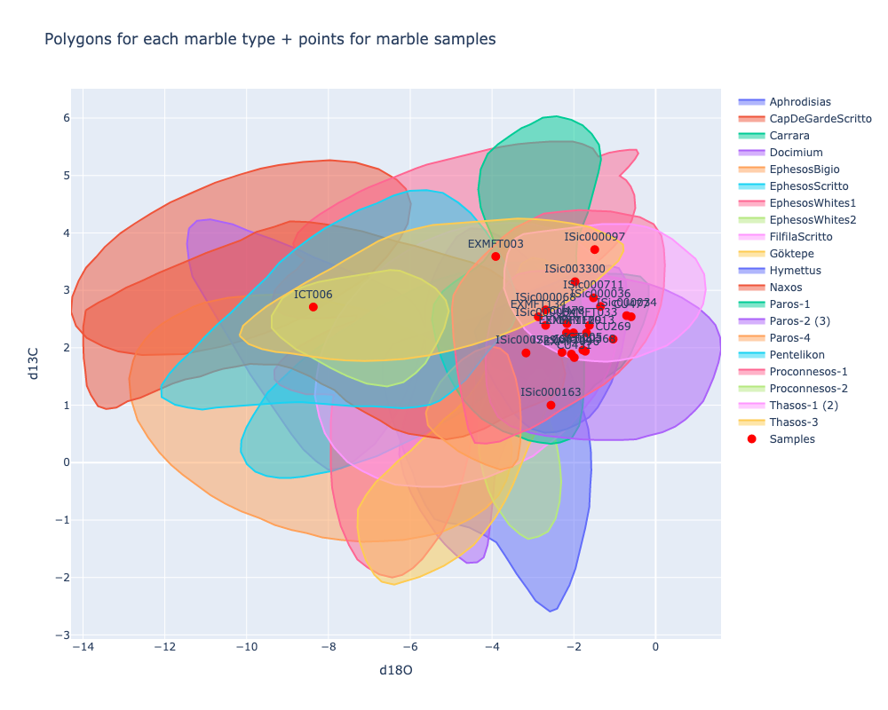

# Crossreads: Petrography

This project provides tools and scripts for petrographic analysis as part of the Crossreads Project at the University of Oxford. It includes functionality for processing XRD (X-ray Diffraction) and pXRF (portable X-ray Fluorescence) data, as well as utilities for interacting with Google Sheets for data storage and retrieval.

Project structure:

- `crossreads_petrography/`: Main package directory
  - `isotopes.py`: For processing isotope data
  - `pxrf.py`: For processing pXRF data
  - `xrd.py`: For processing XRD data
  - `utils.py`: Utility functions for data handling and Google Sheets integration
- `notebooks/`: Jupyter notebooks for data analysis
- `tests/`: Unit tests
- `data/`: Directory for input and output data

## Install

Install the package directly from GitHub using pip:

```python
!pip install -qU git+https://github.com/kingsdigitallab/crossreads-petrography
```

For development or local modifications, clone the repo and install via `pip install -e ". [dev]"`.

### Configure

The project uses a flexible configuration system to manage paths and settings across different environments (local development, Google Colab, and production).

#### Setup

1. On first run, a default `config.yaml` file will be created in `~/crossreads_petrography_data/`.
2. Modify this file to adjust paths or URLs as needed for your environment.

#### Key Configuration Options

- `production`: Set to `true` for production environment, `false` for development.
- `paths`: Contains paths for various data sources and outputs.
  - Each path typically has `local` and `colab` options.
  - Some paths include `url` options for Google Sheets integration.

#### Environment-specific Behavior

- Local development: Uses Google sheets integration if available, otherwise local files
- Google Colab: Automatically uses Colab-specific paths and authentication.
- Production: Can use different URLs or paths as specified in the config; requires Google sheets integration

#### Google Sheets Integration

To use the Google Sheets integration:

1. For Google Colab: Authentication is handled automatically.

2. For local development: Place your Google service account credentials JSON file at:
   ```
   ~/crossreads_petrography_data/credentials.json
   ```

This path is defined in the config file as `paths.credentials.local`.

```python
# disabling logs for readme
from crossreads_petrography.utils import logger
logger.remove()
```

## Usage

### Metadata

```python
from crossreads_petrography.utils import read_crossreads_spreadsheet
df_meta = read_crossreads_spreadsheet()
```

### Isotope Processing

The `IsotopeConverter` class in `crossreads_petrography.isotopes` handles the processing of isotope data. It performs the following tasks:

- Reads isotope curve data and sample data from Google Sheets
- Determines polygon intersections for marble types
- Generates interactive plots of isotope curves and sample points
- Saves the processed data and plots to output files

```python
from crossreads_petrography.isotopes import IsotopeConverter
isotope_converter = IsotopeConverter()
isotope_converter.run()
```

### pXRF Processing

The `PXRFConverter` class in `pxrf.py` handles the processing of portable X-ray Fluorescence (pXRF) data. It performs the following tasks:

- Loads pXRF standard values and descriptions
- Parses pXRF measurements
- Calculates linear regressions for standard values
- Computes adjusted element fractions based on the regressions
- Generates plots of the linear regressions
- Saves the processed data to an Excel file

```python
from crossreads_petrography.pxrf import PXRFConverter
pxrf_converter = PXRFConverter()
pxrf_converter.run()
```

### XRD Processing

The `XRDConverter` class in `xrd.py` handles the processing of X-ray Diffraction (XRD) data. It performs the following tasks:

- Reads XRD data from input files
- Maps XRD parameters to standardized column names
- Calculates combined columns for clay minerals, K-feldspar, and plagioclase
- Updates the main CrossReads spreadsheet with processed XRD data

```python
from crossreads_petrography.xrd import XRDConverter
xrd_converter = XRDConverter()
xrd_converter.run()
```

## Explanation

### Isotopes

```python
from crossreads_petrography.isotopes import *
isotope_converter = IsotopeConverter()
```

#### Polygon data

The class pulls polygon data locally or from Google Drive if on Colab:

```python
print(f'In Colab? {IN_COLAB}')
print(f'Isotope input data path is: {get_path("isotopes.polygons")}')
```

↓

    In Colab? False
    Isotope input data path is: /Users/ryan/crossreads_petrography_data/data/input/isotopes

From here the sample polygons (ranged x,y values) are taken, where x is delta13C and y is delta18O:

```python
isotope_converter.df_curves
```

<div>

<table border="1" class="dataframe">
  <thead>
    <tr style="text-align: right;">
      <th></th>
      <th>marble_type</th>
      <th>x</th>
      <th>y</th>
    </tr>
  </thead>
  <tbody>
    <tr>
      <th>2</th>
      <td>Aphrodisias</td>
      <td>-6.529338</td>
      <td>1.953317</td>
    </tr>
    <tr>
      <th>3</th>
      <td>Naxos</td>
      <td>-13.932584</td>
      <td>2.653563</td>
    </tr>
    <tr>
      <th>4</th>
      <td>Paros-2 (3)</td>
      <td>-3.583021</td>
      <td>3.157248</td>
    </tr>
    <tr>
      <th>5</th>
      <td>Pentelikon</td>
      <td>-12.089915</td>
      <td>1.334951</td>
    </tr>
    <tr>
      <th>6</th>
      <td>Paros-4</td>
      <td>-5.617978</td>
      <td>0.872236</td>
    </tr>
    <tr>
      <th>...</th>
      <td>...</td>
      <td>...</td>
      <td>...</td>
    </tr>
    <tr>
      <th>4071</th>
      <td>EphesosWhites1</td>
      <td>-9.307172</td>
      <td>3.005405</td>
    </tr>
    <tr>
      <th>4091</th>
      <td>EphesosWhites1</td>
      <td>-9.144790</td>
      <td>3.135135</td>
    </tr>
    <tr>
      <th>4111</th>
      <td>EphesosWhites1</td>
      <td>-8.982409</td>
      <td>3.254054</td>
    </tr>
    <tr>
      <th>4131</th>
      <td>EphesosWhites1</td>
      <td>-8.779432</td>
      <td>3.362162</td>
    </tr>
    <tr>
      <th>4151</th>
      <td>EphesosWhites1</td>
      <td>-8.568336</td>
      <td>3.524324</td>
    </tr>
  </tbody>
</table>
<p>1067 rows × 3 columns</p>
</div>

#### Sample data

And from the crossreads spreadsheet are taken points for the same values for samples:

```python
isotope_converter.df_points
```

<div>

<table border="1" class="dataframe">
  <thead>
    <tr style="text-align: right;">
      <th></th>
      <th>Sample</th>
      <th>x</th>
      <th>y</th>
    </tr>
  </thead>
  <tbody>
    <tr>
      <th>0</th>
      <td>ISic000104</td>
      <td>-2.29</td>
      <td>1.92</td>
    </tr>
    <tr>
      <th>2</th>
      <td>ISic000097</td>
      <td>-1.49</td>
      <td>3.71</td>
    </tr>
    <tr>
      <th>3</th>
      <td>ISic000004</td>
      <td>-2.69</td>
      <td>2.39</td>
    </tr>
    <tr>
      <th>4</th>
      <td>ISic000034</td>
      <td>-0.71</td>
      <td>2.56</td>
    </tr>
    <tr>
      <th>5</th>
      <td>ISic000036</td>
      <td>-1.35</td>
      <td>2.72</td>
    </tr>
    <tr>
      <th>6</th>
      <td>ISic000068</td>
      <td>-2.69</td>
      <td>2.66</td>
    </tr>
    <tr>
      <th>8</th>
      <td>ISic000163</td>
      <td>-2.56</td>
      <td>1.00</td>
    </tr>
    <tr>
      <th>9</th>
      <td>ISic000368</td>
      <td>-1.72</td>
      <td>1.94</td>
    </tr>
    <tr>
      <th>10</th>
      <td>ISic000711</td>
      <td>-1.52</td>
      <td>2.87</td>
    </tr>
    <tr>
      <th>11</th>
      <td>ISic000729</td>
      <td>-3.17</td>
      <td>1.91</td>
    </tr>
    <tr>
      <th>12</th>
      <td>ISic003300</td>
      <td>-1.97</td>
      <td>3.15</td>
    </tr>
    <tr>
      <th>13</th>
      <td>CU269</td>
      <td>-1.04</td>
      <td>2.15</td>
    </tr>
    <tr>
      <th>14</th>
      <td>CU431</td>
      <td>-1.99</td>
      <td>1.83</td>
    </tr>
    <tr>
      <th>15</th>
      <td>CU477</td>
      <td>-0.60</td>
      <td>2.54</td>
    </tr>
    <tr>
      <th>16</th>
      <td>CU478</td>
      <td>-2.17</td>
      <td>2.42</td>
    </tr>
    <tr>
      <th>17</th>
      <td>EXMFT003</td>
      <td>-3.91</td>
      <td>3.59</td>
    </tr>
    <tr>
      <th>18</th>
      <td>EXMFT013</td>
      <td>-1.69</td>
      <td>2.26</td>
    </tr>
    <tr>
      <th>19</th>
      <td>EXMFT033</td>
      <td>-1.62</td>
      <td>2.39</td>
    </tr>
    <tr>
      <th>20</th>
      <td>EXMFT096</td>
      <td>-2.06</td>
      <td>1.89</td>
    </tr>
    <tr>
      <th>21</th>
      <td>EXMFT109</td>
      <td>-2.01</td>
      <td>2.26</td>
    </tr>
    <tr>
      <th>22</th>
      <td>EXMFT112</td>
      <td>-2.18</td>
      <td>2.26</td>
    </tr>
    <tr>
      <th>23</th>
      <td>EXMFT134</td>
      <td>-2.87</td>
      <td>2.54</td>
    </tr>
    <tr>
      <th>24</th>
      <td>ICT005</td>
      <td>-1.78</td>
      <td>1.96</td>
    </tr>
    <tr>
      <th>25</th>
      <td>ICT006</td>
      <td>-8.37</td>
      <td>2.71</td>
    </tr>
  </tbody>
</table>
</div>

#### Intersecting samples and polygons

##### Plotting intersections

From here we can plot the samples onto the polygons:

```python
isotope_converter.plot(output_folder=get_path('isotopes.output'))
show_img(get_path('isotopes.output') / 'isotope_graph.png')
```

↓

    

    

##### Intersection table

As well as map intersections:

```python
isotope_converter.df_intersections
```

<div>

<table border="1" class="dataframe">
  <thead>
    <tr style="text-align: right;">
      <th></th>
      <th>Aphrodisias</th>
      <th>CapDeGardeScritto</th>
      <th>Carrara</th>
      <th>Docimium</th>
      <th>EphesosBigio</th>
      <th>EphesosScritto</th>
      <th>EphesosWhites1</th>
      <th>EphesosWhites2</th>
      <th>FilfilaScritto</th>
      <th>Göktepe</th>
      <th>Hymettus</th>
      <th>Naxos</th>
      <th>Paros-1</th>
      <th>Paros-2 (3)</th>
      <th>Paros-4</th>
      <th>Pentelikon</th>
      <th>Proconnesos-1</th>
      <th>Proconnesos-2</th>
      <th>Thasos-1 (2)</th>
      <th>Thasos-3</th>
    </tr>
  </thead>
  <tbody>
    <tr>
      <th>ISic000104</th>
      <td>✔️</td>
      <td></td>
      <td>✔️</td>
      <td></td>
      <td></td>
      <td></td>
      <td></td>
      <td></td>
      <td>✔️</td>
      <td>✔️</td>
      <td>✔️</td>
      <td></td>
      <td>✔️</td>
      <td>✔️</td>
      <td></td>
      <td></td>
      <td>✔️</td>
      <td></td>
      <td>✔️</td>
      <td></td>
    </tr>
    <tr>
      <th>ISic000097</th>
      <td></td>
      <td></td>
      <td></td>
      <td></td>
      <td></td>
      <td></td>
      <td>✔️</td>
      <td></td>
      <td></td>
      <td></td>
      <td></td>
      <td></td>
      <td></td>
      <td></td>
      <td></td>
      <td></td>
      <td>✔️</td>
      <td></td>
      <td>✔️</td>
      <td>✔️</td>
    </tr>
    <tr>
      <th>ISic000004</th>
      <td>✔️</td>
      <td></td>
      <td>✔️</td>
      <td>✔️</td>
      <td></td>
      <td>✔️</td>
      <td></td>
      <td></td>
      <td>✔️</td>
      <td>✔️</td>
      <td>✔️</td>
      <td>✔️</td>
      <td>✔️</td>
      <td>✔️</td>
      <td></td>
      <td></td>
      <td>✔️</td>
      <td></td>
      <td>✔️</td>
      <td></td>
    </tr>
    <tr>
      <th>ISic000034</th>
      <td></td>
      <td></td>
      <td>✔️</td>
      <td></td>
      <td></td>
      <td></td>
      <td></td>
      <td></td>
      <td></td>
      <td></td>
      <td>✔️</td>
      <td></td>
      <td></td>
      <td>✔️</td>
      <td></td>
      <td></td>
      <td>✔️</td>
      <td></td>
      <td>✔️</td>
      <td></td>
    </tr>
    <tr>
      <th>ISic000036</th>
      <td></td>
      <td></td>
      <td>✔️</td>
      <td></td>
      <td></td>
      <td></td>
      <td></td>
      <td></td>
      <td>✔️</td>
      <td></td>
      <td>✔️</td>
      <td></td>
      <td></td>
      <td>✔️</td>
      <td></td>
      <td></td>
      <td>✔️</td>
      <td></td>
      <td>✔️</td>
      <td></td>
    </tr>
    <tr>
      <th>ISic000068</th>
      <td></td>
      <td></td>
      <td>✔️</td>
      <td>✔️</td>
      <td></td>
      <td>✔️</td>
      <td></td>
      <td></td>
      <td>✔️</td>
      <td>✔️</td>
      <td>✔️</td>
      <td></td>
      <td>✔️</td>
      <td>✔️</td>
      <td></td>
      <td></td>
      <td>✔️</td>
      <td></td>
      <td>✔️</td>
      <td>✔️</td>
    </tr>
    <tr>
      <th>ISic000163</th>
      <td>✔️</td>
      <td></td>
      <td>✔️</td>
      <td></td>
      <td></td>
      <td></td>
      <td></td>
      <td></td>
      <td>✔️</td>
      <td></td>
      <td>✔️</td>
      <td></td>
      <td>✔️</td>
      <td>✔️</td>
      <td></td>
      <td></td>
      <td>✔️</td>
      <td></td>
      <td></td>
      <td></td>
    </tr>
    <tr>
      <th>ISic000368</th>
      <td></td>
      <td></td>
      <td>✔️</td>
      <td></td>
      <td></td>
      <td></td>
      <td></td>
      <td></td>
      <td>✔️</td>
      <td></td>
      <td>✔️</td>
      <td></td>
      <td></td>
      <td>✔️</td>
      <td></td>
      <td></td>
      <td>✔️</td>
      <td></td>
      <td>✔️</td>
      <td></td>
    </tr>
    <tr>
      <th>ISic000711</th>
      <td></td>
      <td></td>
      <td>✔️</td>
      <td></td>
      <td></td>
      <td></td>
      <td></td>
      <td></td>
      <td>✔️</td>
      <td></td>
      <td>✔️</td>
      <td></td>
      <td></td>
      <td>✔️</td>
      <td></td>
      <td></td>
      <td>✔️</td>
      <td></td>
      <td>✔️</td>
      <td></td>
    </tr>
    <tr>
      <th>ISic000729</th>
      <td>✔️</td>
      <td></td>
      <td>✔️</td>
      <td>✔️</td>
      <td></td>
      <td>✔️</td>
      <td></td>
      <td></td>
      <td>✔️</td>
      <td>✔️</td>
      <td>✔️</td>
      <td>✔️</td>
      <td>✔️</td>
      <td>✔️</td>
      <td></td>
      <td></td>
      <td>✔️</td>
      <td></td>
      <td></td>
      <td></td>
    </tr>
    <tr>
      <th>ISic003300</th>
      <td></td>
      <td></td>
      <td>✔️</td>
      <td></td>
      <td></td>
      <td></td>
      <td></td>
      <td></td>
      <td>✔️</td>
      <td></td>
      <td>✔️</td>
      <td></td>
      <td>✔️</td>
      <td>✔️</td>
      <td></td>
      <td></td>
      <td>✔️</td>
      <td></td>
      <td>✔️</td>
      <td>✔️</td>
    </tr>
    <tr>
      <th>CU269</th>
      <td></td>
      <td></td>
      <td>✔️</td>
      <td></td>
      <td></td>
      <td></td>
      <td></td>
      <td></td>
      <td>✔️</td>
      <td></td>
      <td>✔️</td>
      <td></td>
      <td></td>
      <td>✔️</td>
      <td></td>
      <td></td>
      <td>✔️</td>
      <td></td>
      <td>✔️</td>
      <td></td>
    </tr>
    <tr>
      <th>CU431</th>
      <td></td>
      <td></td>
      <td>✔️</td>
      <td></td>
      <td></td>
      <td></td>
      <td></td>
      <td></td>
      <td>✔️</td>
      <td></td>
      <td>✔️</td>
      <td></td>
      <td>✔️</td>
      <td>✔️</td>
      <td></td>
      <td></td>
      <td>✔️</td>
      <td></td>
      <td>✔️</td>
      <td></td>
    </tr>
    <tr>
      <th>CU477</th>
      <td></td>
      <td></td>
      <td>✔️</td>
      <td></td>
      <td></td>
      <td></td>
      <td></td>
      <td></td>
      <td></td>
      <td></td>
      <td></td>
      <td></td>
      <td></td>
      <td>✔️</td>
      <td></td>
      <td></td>
      <td>✔️</td>
      <td></td>
      <td>✔️</td>
      <td></td>
    </tr>
    <tr>
      <th>CU478</th>
      <td></td>
      <td></td>
      <td>✔️</td>
      <td>✔️</td>
      <td></td>
      <td></td>
      <td></td>
      <td></td>
      <td>✔️</td>
      <td>✔️</td>
      <td>✔️</td>
      <td></td>
      <td>✔️</td>
      <td>✔️</td>
      <td></td>
      <td></td>
      <td>✔️</td>
      <td></td>
      <td>✔️</td>
      <td></td>
    </tr>
    <tr>
      <th>EXMFT003</th>
      <td></td>
      <td></td>
      <td></td>
      <td>✔️</td>
      <td></td>
      <td></td>
      <td>✔️</td>
      <td></td>
      <td>✔️</td>
      <td></td>
      <td></td>
      <td></td>
      <td>✔️</td>
      <td></td>
      <td></td>
      <td>✔️</td>
      <td>✔️</td>
      <td></td>
      <td></td>
      <td>✔️</td>
    </tr>
    <tr>
      <th>EXMFT013</th>
      <td></td>
      <td></td>
      <td>✔️</td>
      <td></td>
      <td></td>
      <td></td>
      <td></td>
      <td></td>
      <td>✔️</td>
      <td></td>
      <td>✔️</td>
      <td></td>
      <td></td>
      <td>✔️</td>
      <td></td>
      <td></td>
      <td>✔️</td>
      <td></td>
      <td>✔️</td>
      <td></td>
    </tr>
    <tr>
      <th>EXMFT033</th>
      <td></td>
      <td></td>
      <td>✔️</td>
      <td></td>
      <td></td>
      <td></td>
      <td></td>
      <td></td>
      <td>✔️</td>
      <td></td>
      <td>✔️</td>
      <td></td>
      <td></td>
      <td>✔️</td>
      <td></td>
      <td></td>
      <td>✔️</td>
      <td></td>
      <td>✔️</td>
      <td></td>
    </tr>
    <tr>
      <th>EXMFT096</th>
      <td></td>
      <td></td>
      <td>✔️</td>
      <td></td>
      <td></td>
      <td></td>
      <td></td>
      <td></td>
      <td>✔️</td>
      <td></td>
      <td>✔️</td>
      <td></td>
      <td>✔️</td>
      <td>✔️</td>
      <td></td>
      <td></td>
      <td>✔️</td>
      <td></td>
      <td>✔️</td>
      <td></td>
    </tr>
    <tr>
      <th>EXMFT109</th>
      <td></td>
      <td></td>
      <td>✔️</td>
      <td></td>
      <td></td>
      <td></td>
      <td></td>
      <td></td>
      <td>✔️</td>
      <td>✔️</td>
      <td>✔️</td>
      <td></td>
      <td>✔️</td>
      <td>✔️</td>
      <td></td>
      <td></td>
      <td>✔️</td>
      <td></td>
      <td>✔️</td>
      <td></td>
    </tr>
    <tr>
      <th>EXMFT112</th>
      <td></td>
      <td></td>
      <td>✔️</td>
      <td>✔️</td>
      <td></td>
      <td></td>
      <td></td>
      <td></td>
      <td>✔️</td>
      <td>✔️</td>
      <td>✔️</td>
      <td></td>
      <td>✔️</td>
      <td>✔️</td>
      <td></td>
      <td></td>
      <td>✔️</td>
      <td></td>
      <td>✔️</td>
      <td></td>
    </tr>
    <tr>
      <th>EXMFT134</th>
      <td>✔️</td>
      <td></td>
      <td>✔️</td>
      <td>✔️</td>
      <td></td>
      <td>✔️</td>
      <td></td>
      <td></td>
      <td>✔️</td>
      <td>✔️</td>
      <td>✔️</td>
      <td>✔️</td>
      <td>✔️</td>
      <td>✔️</td>
      <td></td>
      <td></td>
      <td>✔️</td>
      <td></td>
      <td>✔️</td>
      <td>✔️</td>
    </tr>
    <tr>
      <th>ICT005</th>
      <td></td>
      <td></td>
      <td>✔️</td>
      <td></td>
      <td></td>
      <td></td>
      <td></td>
      <td></td>
      <td>✔️</td>
      <td></td>
      <td>✔️</td>
      <td></td>
      <td>✔️</td>
      <td>✔️</td>
      <td></td>
      <td></td>
      <td>✔️</td>
      <td></td>
      <td>✔️</td>
      <td></td>
    </tr>
    <tr>
      <th>ICT006</th>
      <td></td>
      <td>✔️</td>
      <td></td>
      <td>✔️</td>
      <td>✔️</td>
      <td></td>
      <td>✔️</td>
      <td></td>
      <td></td>
      <td></td>
      <td></td>
      <td>✔️</td>
      <td></td>
      <td></td>
      <td></td>
      <td>✔️</td>
      <td></td>
      <td>✔️</td>
      <td></td>
      <td>✔️</td>
    </tr>
  </tbody>
</table>
</div>

