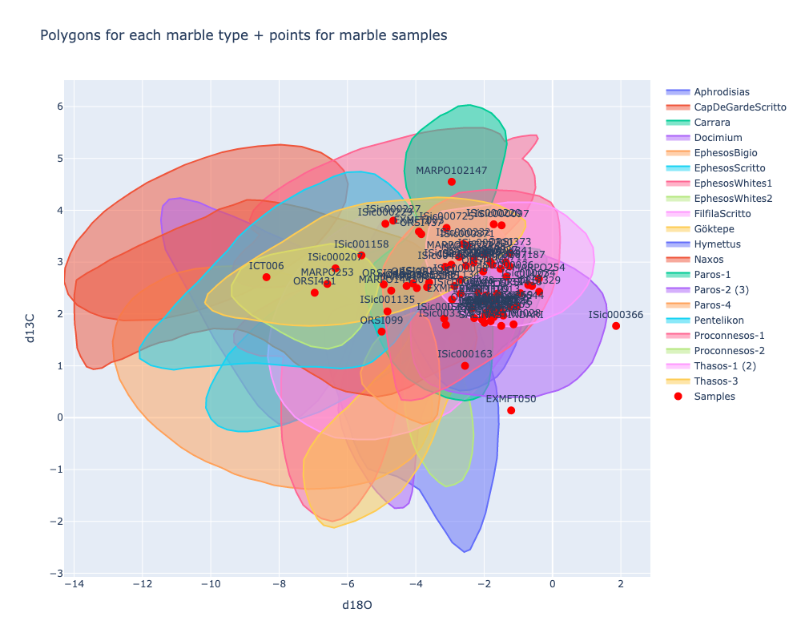

# Crossreads: Petrography

This project provides tools and scripts for petrographic analysis as part of the Crossreads Project at the University of Oxford. It includes functionality for processing XRD (X-ray Diffraction) and pXRF (portable X-ray Fluorescence) data, as well as utilities for interacting with Google Sheets for data storage and retrieval.

Project structure:

- `crossreads_petrography/`: Main package directory
  - `isotopes.py`: For processing isotope data
  - `pxrf.py`: For processing pXRF data
  - `xrd.py`: For processing XRD data
  - `utils.py`: Utility functions for data handling and Google Sheets integration
- `notebooks/`: Jupyter notebooks for data analysis
- `tests/`: Unit tests
- `data/`: Directory for input and output data (not tracked in git)

## Install

Install the package directly from GitHub using pip:

```python
#pip install git+https://github.com/quadrismegistus/crossreads-petrography
```

For development or local modifications, clone the repo and install via `pip install -e ". [dev]"`.

### Configure

To use the Google Sheets integration:

1. For Google Colab: Authentication is handled automatically.
2. For local development: Place your Google service account credentials JSON file at:
   ```
   ~/.config/crossreads_petrography/credentials.json
   ```

## Usage

### Metadata

```python
from crossreads_petrography.utils import read_crossreads_spreadsheet
df_meta = read_crossreads_spreadsheet()
```

    Authenticating and accessing Google Spreadsheet @ 2024-07-18 17:43:41,623
    Reading data from spreadsheet worksheet 0 @ 2024-07-18 17:43:43,140
    Read 177 rows from spreadsheet @ 2024-07-18 17:43:44,090

### Isotope Processing

The `IsotopeConverter` class in `crossreads_petrography.isotopes` handles the processing of isotope data. It performs the following tasks:

- Reads isotope curve data and sample data from Google Sheets
- Determines polygon intersections for marble types
- Generates interactive plots of isotope curves and sample points
- Saves the processed data and plots to output files

```python
from crossreads_petrography.isotopes import IsotopeConverter
isotope_converter = IsotopeConverter()
isotope_converter.run()
```

    Initializing IsotopeConverter @ 2024-07-18 17:43:44,103
    Processing isotope data @ 2024-07-18 17:43:44,104
    Generating isotope outputs @ 2024-07-18 17:43:44,105
    Reading isotope curve data @ 2024-07-18 17:43:44,105
    Reading spreadsheet data from /Users/ryan/github/crossreads-petrography/data/input/isotopes @ 2024-07-18 17:43:44,105
    Reading dataframe from file: /Users/ryan/github/crossreads-petrography/data/input/isotopes/isotopes-curves.xlsx @ 2024-07-18 17:43:44,107
    Reading dataframe from file: /Users/ryan/github/crossreads-petrography/data/input/isotopes/other-marbles-polygons-2.xlsx @ 2024-07-18 17:43:44,245
    Read 208 rows from input data @ 2024-07-18 17:43:44,262
    Authenticating and accessing Google Spreadsheet @ 2024-07-18 17:43:44,281
    Reading data from spreadsheet worksheet 0 @ 2024-07-18 17:43:45,167
    Read 177 rows from spreadsheet @ 2024-07-18 17:43:46,777
    Saved: /Users/ryan/github/crossreads-petrography/data/output/isotopes/isotope_intersections.xlsx @ 2024-07-18 17:43:46,839
    Saved: /Users/ryan/github/crossreads-petrography/data/output/isotopes/isotope_graph.png @ 2024-07-18 17:43:47,441
    Saved: /Users/ryan/github/crossreads-petrography/data/output/isotopes/isotope_graph.html @ 2024-07-18 17:43:47,461
    Saved: /Users/ryan/github/crossreads-petrography/data/output/isotopes/isotope_graph.pdf @ 2024-07-18 17:43:47,555

### pXRF Processing

The `PXRFConverter` class in `pxrf.py` handles the processing of portable X-ray Fluorescence (pXRF) data. It performs the following tasks:

- Loads pXRF standard values and descriptions
- Parses pXRF measurements
- Calculates linear regressions for standard values
- Computes adjusted element fractions based on the regressions
- Generates plots of the linear regressions
- Saves the processed data to an Excel file

```python
from crossreads_petrography.pxrf import PXRFConverter
pxrf_converter = PXRFConverter()
pxrf_converter.run()
```

    Initializing PXRFConverter @ 2024-07-18 17:43:47,565
    Processing pXRF data @ 2024-07-18 17:43:47,565
    Saving pXRF processed data @ 2024-07-18 17:43:47,566
    Parsing pXRF measurements and calculating new fractions @ 2024-07-18 17:43:47,566
    Calculating linear regressions for standard values @ 2024-07-18 17:43:47,567
    Parsing pXRF standards data @ 2024-07-18 17:43:47,567
    Reading txt data from /Users/ryan/github/crossreads-petrography/data/input/pXRF @ 2024-07-18 17:43:47,567
    Loading pXRF standard values @ 2024-07-18 17:43:47,570
    Authenticating and accessing Google Spreadsheet @ 2024-07-18 17:43:47,570
    Reading data from spreadsheet worksheet 0 @ 2024-07-18 17:43:49,135
    Read 11 rows from spreadsheet @ 2024-07-18 17:43:50,238
    Loading pXRF descriptions @ 2024-07-18 17:43:50,297
    Authenticating and accessing Google Spreadsheet @ 2024-07-18 17:43:50,298
    Reading data from spreadsheet worksheet 0 @ 2024-07-18 17:43:51,880
    Read 22 rows from spreadsheet @ 2024-07-18 17:43:53,662
    Saved: /Users/ryan/github/crossreads-petrography/data/output/pXRF/pXRF_calculated_fractions.xlsx @ 2024-07-18 17:43:54,373

### XRD Processing

The `XRDConverter` class in `xrd.py` handles the processing of X-ray Diffraction (XRD) data. It performs the following tasks:

- Reads XRD data from input files
- Maps XRD parameters to standardized column names
- Calculates combined columns for clay minerals, K-feldspar, and plagioclase
- Updates the main CrossReads spreadsheet with processed XRD data

```python
from crossreads_petrography.xrd import XRDConverter
xrd_converter = XRDConverter()
xrd_converter.run()
```

    Initializing XRDConverter: /Users/ryan/github/crossreads-petrography/data/input/XRD / /content/drive/MyDrive/Crossreads B D1/XRD input data @ 2024-07-18 17:43:54,380
    Authenticating and accessing Google Spreadsheet @ 2024-07-18 17:43:54,380
    Updating CrossReads sheet with XRD data @ 2024-07-18 17:43:55,452
    Reading XRD data @ 2024-07-18 17:43:55,454
    Reading spreadsheet data from /Users/ryan/github/crossreads-petrography/data/input/XRD @ 2024-07-18 17:43:55,455
    Reading dataframe from file: /Users/ryan/github/crossreads-petrography/data/input/XRD/xrd-results-tao.CSV @ 2024-07-18 17:43:55,462
    Reading dataframe from file: /Users/ryan/github/crossreads-petrography/data/input/XRD/XRD-results-sample.CSV @ 2024-07-18 17:43:55,475
    Read 426 rows from input data @ 2024-07-18 17:43:55,483
    Reading CrossReads sheet from Google Spreadsheet @ 2024-07-18 17:43:55,495
    Reading data from spreadsheet worksheet 0 @ 2024-07-18 17:43:55,496
    Read 177 rows from spreadsheet @ 2024-07-18 17:43:56,891
    Updated 0 values in 0 samples @ 2024-07-18 17:43:56,910
    No updates to apply @ 2024-07-18 17:43:56,910

## Explanation

### Isotopes

```python
from crossreads_petrography.isotopes import *
isotope_converter = IsotopeConverter()
```

    Initializing IsotopeConverter @ 2024-07-18 17:43:56,915

#### Polygon data

The class pulls polygon data locally or from Google Drive if on Colab:

```python
print(f'In Colab? {IN_COLAB}')
print(f'Isotope input data path is: {PATH_ISOTOPE_INPUT_COLAB if IN_COLAB else PATH_ISOTOPE_INPUT_DATA}')
```

    In Colab? False
    Isotope input data path is: /Users/ryan/github/crossreads-petrography/data/input/isotopes

From here the sample polygons (ranged x,y values) are taken, where x is delta13C and y is delta18O:

```python
isotope_converter.df_curves
```

    Reading isotope curve data @ 2024-07-18 17:43:56,925
    Reading spreadsheet data from /Users/ryan/github/crossreads-petrography/data/input/isotopes @ 2024-07-18 17:43:56,926
    Reading dataframe from file: /Users/ryan/github/crossreads-petrography/data/input/isotopes/isotopes-curves.xlsx @ 2024-07-18 17:43:56,927
    Reading dataframe from file: /Users/ryan/github/crossreads-petrography/data/input/isotopes/other-marbles-polygons-2.xlsx @ 2024-07-18 17:43:56,951
    Read 208 rows from input data @ 2024-07-18 17:43:56,972

<div>

<table border="1" class="dataframe">
  <thead>
    <tr style="text-align: right;">
      <th></th>
      <th>marble_type</th>
      <th>x</th>
      <th>y</th>
    </tr>
  </thead>
  <tbody>
    <tr>
      <th>0</th>
      <td>Paros-4</td>
      <td>-5.617978</td>
      <td>0.872236</td>
    </tr>
    <tr>
      <th>2</th>
      <td>Thasos-3</td>
      <td>-10.174782</td>
      <td>2.211302</td>
    </tr>
    <tr>
      <th>4</th>
      <td>Göktepe</td>
      <td>-3.268530</td>
      <td>3.470874</td>
    </tr>
    <tr>
      <th>7</th>
      <td>Paros-2 (3)</td>
      <td>-3.583021</td>
      <td>3.157248</td>
    </tr>
    <tr>
      <th>8</th>
      <td>Proconnesos-1</td>
      <td>-4.981273</td>
      <td>2.678133</td>
    </tr>
    <tr>
      <th>...</th>
      <td>...</td>
      <td>...</td>
      <td>...</td>
    </tr>
    <tr>
      <th>4072</th>
      <td>EphesosWhites1</td>
      <td>-9.307172</td>
      <td>3.005405</td>
    </tr>
    <tr>
      <th>4092</th>
      <td>EphesosWhites1</td>
      <td>-9.144790</td>
      <td>3.135135</td>
    </tr>
    <tr>
      <th>4112</th>
      <td>EphesosWhites1</td>
      <td>-8.982409</td>
      <td>3.254054</td>
    </tr>
    <tr>
      <th>4132</th>
      <td>EphesosWhites1</td>
      <td>-8.779432</td>
      <td>3.362162</td>
    </tr>
    <tr>
      <th>4152</th>
      <td>EphesosWhites1</td>
      <td>-8.568336</td>
      <td>3.524324</td>
    </tr>
  </tbody>
</table>
<p>1067 rows × 3 columns</p>
</div>

#### Sample data

And from the crossreads spreadsheet are taken points for the same values for samples:

```python
isotope_converter.df_points
```

    Authenticating and accessing Google Spreadsheet @ 2024-07-18 17:43:57,008
    Reading data from spreadsheet worksheet 0 @ 2024-07-18 17:43:58,415
    Read 177 rows from spreadsheet @ 2024-07-18 17:43:59,901

<div>

<table border="1" class="dataframe">
  <thead>
    <tr style="text-align: right;">
      <th></th>
      <th>Sample</th>
      <th>x</th>
      <th>y</th>
    </tr>
  </thead>
  <tbody>
    <tr>
      <th>0</th>
      <td>ISic000104</td>
      <td>-2.29</td>
      <td>1.92</td>
    </tr>
    <tr>
      <th>2</th>
      <td>ISic000097</td>
      <td>-1.49</td>
      <td>3.71</td>
    </tr>
    <tr>
      <th>3</th>
      <td>ISic000004</td>
      <td>-2.69</td>
      <td>2.39</td>
    </tr>
    <tr>
      <th>4</th>
      <td>ISic000034</td>
      <td>-0.71</td>
      <td>2.56</td>
    </tr>
    <tr>
      <th>5</th>
      <td>ISic000036</td>
      <td>-1.35</td>
      <td>2.72</td>
    </tr>
    <tr>
      <th>...</th>
      <td>...</td>
      <td>...</td>
      <td>...</td>
    </tr>
    <tr>
      <th>91</th>
      <td>EXMFT109</td>
      <td>-2.01</td>
      <td>2.26</td>
    </tr>
    <tr>
      <th>92</th>
      <td>EXMFT112</td>
      <td>-2.18</td>
      <td>2.26</td>
    </tr>
    <tr>
      <th>93</th>
      <td>EXMFT134</td>
      <td>-2.87</td>
      <td>2.54</td>
    </tr>
    <tr>
      <th>94</th>
      <td>ICT005</td>
      <td>-1.78</td>
      <td>1.96</td>
    </tr>
    <tr>
      <th>95</th>
      <td>ICT006</td>
      <td>-8.37</td>
      <td>2.71</td>
    </tr>
  </tbody>
</table>
<p>81 rows × 3 columns</p>
</div>

#### Intersecting samples and polygons

##### Plotting intersections

From here we can plot the samples onto the polygons:

```python
isotope_converter.plot(output_folder=PATH_ISOTOPE_OUTPUT)
show_img(PATH_ISOTOPE_OUTPUT / 'isotope_graph.png')
```

    Saved: /Users/ryan/github/crossreads-petrography/data/output/isotopes/isotope_graph.png @ 2024-07-18 17:44:00,065
    Saved: /Users/ryan/github/crossreads-petrography/data/output/isotopes/isotope_graph.html @ 2024-07-18 17:44:00,077
    Saved: /Users/ryan/github/crossreads-petrography/data/output/isotopes/isotope_graph.pdf @ 2024-07-18 17:44:00,149

    

    

##### Intersection table

As well as map intersections:

```python
# Dataframe for intersections
isotope_converter.df_intersections
```

<div>

<table border="1" class="dataframe">
  <thead>
    <tr style="text-align: right;">
      <th></th>
      <th>Aphrodisias</th>
      <th>CapDeGardeScritto</th>
      <th>Carrara</th>
      <th>Docimium</th>
      <th>EphesosBigio</th>
      <th>EphesosScritto</th>
      <th>EphesosWhites1</th>
      <th>EphesosWhites2</th>
      <th>FilfilaScritto</th>
      <th>Göktepe</th>
      <th>Hymettus</th>
      <th>Naxos</th>
      <th>Paros-1</th>
      <th>Paros-2 (3)</th>
      <th>Paros-4</th>
      <th>Pentelikon</th>
      <th>Proconnesos-1</th>
      <th>Proconnesos-2</th>
      <th>Thasos-1 (2)</th>
      <th>Thasos-3</th>
    </tr>
  </thead>
  <tbody>
    <tr>
      <th>ISic000104</th>
      <td>✔️</td>
      <td></td>
      <td>✔️</td>
      <td></td>
      <td></td>
      <td></td>
      <td></td>
      <td></td>
      <td>✔️</td>
      <td>✔️</td>
      <td>✔️</td>
      <td></td>
      <td>✔️</td>
      <td>✔️</td>
      <td></td>
      <td></td>
      <td>✔️</td>
      <td></td>
      <td>✔️</td>
      <td></td>
    </tr>
    <tr>
      <th>ISic000097</th>
      <td></td>
      <td></td>
      <td></td>
      <td></td>
      <td></td>
      <td></td>
      <td>✔️</td>
      <td></td>
      <td></td>
      <td></td>
      <td></td>
      <td></td>
      <td></td>
      <td></td>
      <td></td>
      <td></td>
      <td>✔️</td>
      <td></td>
      <td>✔️</td>
      <td>✔️</td>
    </tr>
    <tr>
      <th>ISic000004</th>
      <td>✔️</td>
      <td></td>
      <td>✔️</td>
      <td>✔️</td>
      <td></td>
      <td>✔️</td>
      <td></td>
      <td></td>
      <td>✔️</td>
      <td>✔️</td>
      <td>✔️</td>
      <td>✔️</td>
      <td>✔️</td>
      <td>✔️</td>
      <td></td>
      <td></td>
      <td>✔️</td>
      <td></td>
      <td>✔️</td>
      <td></td>
    </tr>
    <tr>
      <th>ISic000034</th>
      <td></td>
      <td></td>
      <td>✔️</td>
      <td></td>
      <td></td>
      <td></td>
      <td></td>
      <td></td>
      <td></td>
      <td></td>
      <td>✔️</td>
      <td></td>
      <td></td>
      <td>✔️</td>
      <td></td>
      <td></td>
      <td>✔️</td>
      <td></td>
      <td>✔️</td>
      <td></td>
    </tr>
    <tr>
      <th>ISic000036</th>
      <td></td>
      <td></td>
      <td>✔️</td>
      <td></td>
      <td></td>
      <td></td>
      <td></td>
      <td></td>
      <td>✔️</td>
      <td></td>
      <td>✔️</td>
      <td></td>
      <td></td>
      <td>✔️</td>
      <td></td>
      <td></td>
      <td>✔️</td>
      <td></td>
      <td>✔️</td>
      <td></td>
    </tr>
    <tr>
      <th>...</th>
      <td>...</td>
      <td>...</td>
      <td>...</td>
      <td>...</td>
      <td>...</td>
      <td>...</td>
      <td>...</td>
      <td>...</td>
      <td>...</td>
      <td>...</td>
      <td>...</td>
      <td>...</td>
      <td>...</td>
      <td>...</td>
      <td>...</td>
      <td>...</td>
      <td>...</td>
      <td>...</td>
      <td>...</td>
      <td>...</td>
    </tr>
    <tr>
      <th>EXMFT109</th>
      <td></td>
      <td></td>
      <td>✔️</td>
      <td></td>
      <td></td>
      <td></td>
      <td></td>
      <td></td>
      <td>✔️</td>
      <td>✔️</td>
      <td>✔️</td>
      <td></td>
      <td>✔️</td>
      <td>✔️</td>
      <td></td>
      <td></td>
      <td>✔️</td>
      <td></td>
      <td>✔️</td>
      <td></td>
    </tr>
    <tr>
      <th>EXMFT112</th>
      <td></td>
      <td></td>
      <td>✔️</td>
      <td>✔️</td>
      <td></td>
      <td></td>
      <td></td>
      <td></td>
      <td>✔️</td>
      <td>✔️</td>
      <td>✔️</td>
      <td></td>
      <td>✔️</td>
      <td>✔️</td>
      <td></td>
      <td></td>
      <td>✔️</td>
      <td></td>
      <td>✔️</td>
      <td></td>
    </tr>
    <tr>
      <th>EXMFT134</th>
      <td>✔️</td>
      <td></td>
      <td>✔️</td>
      <td>✔️</td>
      <td></td>
      <td>✔️</td>
      <td></td>
      <td></td>
      <td>✔️</td>
      <td>✔️</td>
      <td>✔️</td>
      <td>✔️</td>
      <td>✔️</td>
      <td>✔️</td>
      <td></td>
      <td></td>
      <td>✔️</td>
      <td></td>
      <td>✔️</td>
      <td>✔️</td>
    </tr>
    <tr>
      <th>ICT005</th>
      <td></td>
      <td></td>
      <td>✔️</td>
      <td></td>
      <td></td>
      <td></td>
      <td></td>
      <td></td>
      <td>✔️</td>
      <td></td>
      <td>✔️</td>
      <td></td>
      <td>✔️</td>
      <td>✔️</td>
      <td></td>
      <td></td>
      <td>✔️</td>
      <td></td>
      <td>✔️</td>
      <td></td>
    </tr>
    <tr>
      <th>ICT006</th>
      <td></td>
      <td>✔️</td>
      <td></td>
      <td>✔️</td>
      <td>✔️</td>
      <td></td>
      <td>✔️</td>
      <td></td>
      <td></td>
      <td></td>
      <td></td>
      <td>✔️</td>
      <td></td>
      <td></td>
      <td></td>
      <td>✔️</td>
      <td></td>
      <td>✔️</td>
      <td></td>
      <td>✔️</td>
    </tr>
  </tbody>
</table>
<p>81 rows × 20 columns</p>
</div>

