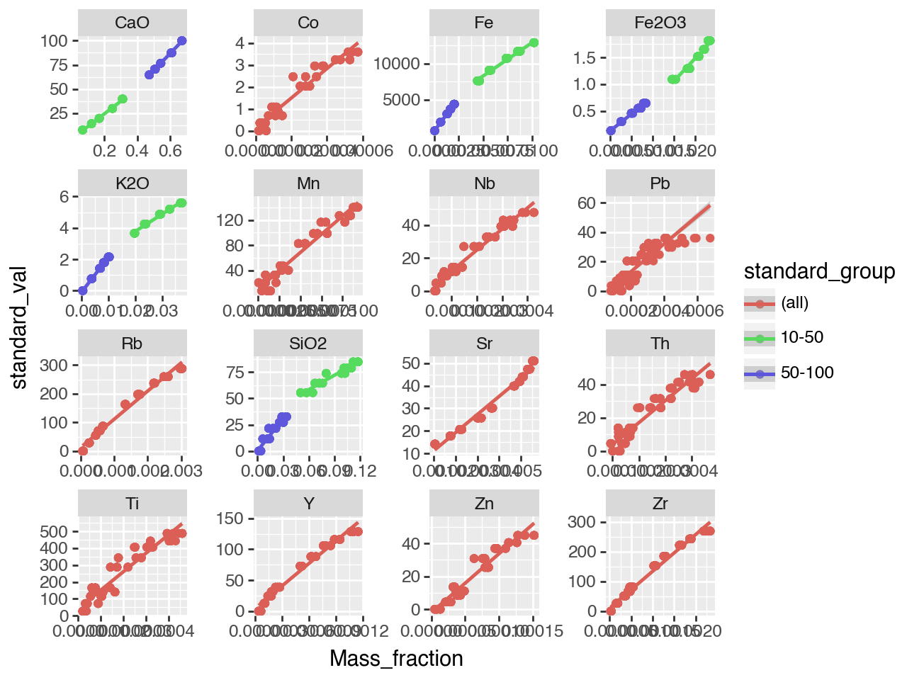

# Crossreads Petrography: pXRF Processing

```python
import sys; sys.path.append('..')
from crossreads_petrography.pxrf import *
```

↓

    Using user-specific config file: /Users/ryan/crossreads_petrography_data/config.yaml @ 2024-08-26 19:00:46,685
    Initializing Config with yaml_path: /Users/ryan/crossreads_petrography_data/config.yaml @ 2024-08-26 19:00:46,685
    Loading config from /Users/ryan/crossreads_petrography_data/config.yaml @ 2024-08-26 19:00:46,685
    Config loaded and processed successfully @ 2024-08-26 19:00:46,690

```python
xrf = PXRFConverter()
xrf
```

↓

    Initializing PXRFConverter @ 2024-08-26 19:00:46,699

    <crossreads_petrography.pxrf.PXRFConverter at 0x1124e6a40>

## Descriptions

This file lives on Google Drive on the Crossreads team drive. It contains notes about the samples, including the Isic codes.

```python
pd.options.display.max_columns = 1000
xrf.df_descriptions
```

↓

    Loading pXRF descriptions @ 2024-08-26 19:00:46,707

<div>

<table border="1" class="dataframe">
  <thead>
    <tr style="text-align: right;">
      <th></th>
      <th>instrument</th>
      <th>site</th>
      <th>day</th>
      <th>month</th>
      <th>year</th>
      <th>cass</th>
      <th>inv/id</th>
      <th>Isic</th>
      <th>count analyses</th>
      <th>a</th>
      <th>b</th>
      <th>c</th>
      <th>d</th>
      <th>e</th>
      <th>f</th>
      <th>g</th>
      <th>h</th>
      <th>i</th>
      <th>j</th>
      <th>k</th>
      <th>l</th>
      <th>m</th>
      <th>n</th>
      <th>o</th>
      <th>p</th>
      <th>q</th>
      <th>r</th>
      <th>s</th>
      <th>t</th>
      <th>u</th>
      <th>v</th>
      <th>w</th>
      <th>x</th>
      <th>y</th>
      <th>z</th>
    </tr>
  </thead>
  <tbody>
    <tr>
      <th>0</th>
      <td>demo-MK</td>
      <td>salinas</td>
      <td></td>
      <td>10</td>
      <td>2022</td>
      <td>museo</td>
      <td></td>
      <td>Isic000004</td>
      <td>6</td>
      <td>wh, between r n, L 1</td>
      <td>wh, between f g, L 1</td>
      <td>wh, end of L 3, diagonal</td>
      <td>gr, x e, L 2</td>
      <td>gr, inside first m of m m, L 1</td>
      <td>between fe c, L 4</td>
      <td></td>
      <td></td>
      <td></td>
      <td></td>
      <td></td>
      <td></td>
      <td></td>
      <td></td>
      <td></td>
      <td></td>
      <td></td>
      <td></td>
      <td></td>
      <td></td>
      <td></td>
      <td></td>
      <td></td>
      <td></td>
      <td></td>
      <td></td>
    </tr>
    <tr>
      <th>1</th>
      <td>demo-MK</td>
      <td>termini imerese</td>
      <td></td>
      <td>3</td>
      <td>2023</td>
      <td>depositi</td>
      <td></td>
      <td>Isic000086</td>
      <td>9</td>
      <td>yellow, v</td>
      <td>yellow, back</td>
      <td>yellow, back</td>
      <td>pink, back</td>
      <td>pink, back</td>
      <td>pink, below I</td>
      <td>rosso, edge</td>
      <td>rosso, back, edge</td>
      <td>rosso, vein</td>
      <td></td>
      <td></td>
      <td></td>
      <td></td>
      <td></td>
      <td></td>
      <td></td>
      <td></td>
      <td></td>
      <td></td>
      <td></td>
      <td></td>
      <td></td>
      <td></td>
      <td></td>
      <td></td>
      <td></td>
    </tr>
    <tr>
      <th>2</th>
      <td>demo-MK</td>
      <td>termini imerese</td>
      <td></td>
      <td>3</td>
      <td>2023</td>
      <td>museo</td>
      <td></td>
      <td>Isic000092</td>
      <td>6</td>
      <td>O, L 1</td>
      <td>Q, L 1</td>
      <td>O, L 1</td>
      <td>sample</td>
      <td>sample</td>
      <td>sample</td>
      <td></td>
      <td></td>
      <td></td>
      <td></td>
      <td></td>
      <td></td>
      <td></td>
      <td></td>
      <td></td>
      <td></td>
      <td></td>
      <td></td>
      <td></td>
      <td></td>
      <td></td>
      <td></td>
      <td></td>
      <td></td>
      <td></td>
      <td></td>
    </tr>
    <tr>
      <th>3</th>
      <td>demo-MK</td>
      <td>termini imerese</td>
      <td></td>
      <td>3</td>
      <td>2023</td>
      <td>museo</td>
      <td></td>
      <td>Isic000095</td>
      <td>15</td>
      <td>yellow</td>
      <td>yellow</td>
      <td>yellow</td>
      <td>orange below GIO</td>
      <td>orange below GIO</td>
      <td>orange o in PO</td>
      <td>dark pink vein</td>
      <td>dark pink vein</td>
      <td>dark pink vein, right side</td>
      <td>pink, above NP</td>
      <td>pink, centre frame</td>
      <td>pink, above EN</td>
      <td>red, sample</td>
      <td>red, sample</td>
      <td>red, sample</td>
      <td></td>
      <td></td>
      <td></td>
      <td></td>
      <td></td>
      <td></td>
      <td></td>
      <td></td>
      <td></td>
      <td></td>
      <td></td>
    </tr>
    <tr>
      <th>4</th>
      <td>demo-MK</td>
      <td>termini imerese</td>
      <td></td>
      <td>3</td>
      <td>2023</td>
      <td>museo</td>
      <td></td>
      <td>Isic000097</td>
      <td>3</td>
      <td>above roc, L 5</td>
      <td>between iv praef, L 6</td>
      <td>E, L 5</td>
      <td></td>
      <td></td>
      <td></td>
      <td></td>
      <td></td>
      <td></td>
      <td></td>
      <td></td>
      <td></td>
      <td></td>
      <td></td>
      <td></td>
      <td></td>
      <td></td>
      <td></td>
      <td></td>
      <td></td>
      <td></td>
      <td></td>
      <td></td>
      <td></td>
      <td></td>
      <td></td>
    </tr>
    <tr>
      <th>...</th>
      <td>...</td>
      <td>...</td>
      <td>...</td>
      <td>...</td>
      <td>...</td>
      <td>...</td>
      <td>...</td>
      <td>...</td>
      <td>...</td>
      <td>...</td>
      <td>...</td>
      <td>...</td>
      <td>...</td>
      <td>...</td>
      <td>...</td>
      <td>...</td>
      <td>...</td>
      <td>...</td>
      <td>...</td>
      <td>...</td>
      <td>...</td>
      <td>...</td>
      <td>...</td>
      <td>...</td>
      <td>...</td>
      <td>...</td>
      <td>...</td>
      <td>...</td>
      <td>...</td>
      <td>...</td>
      <td>...</td>
      <td>...</td>
      <td>...</td>
      <td>...</td>
      <td>...</td>
    </tr>
    <tr>
      <th>597</th>
      <td>demo-MK</td>
      <td>taormina</td>
      <td>22.0</td>
      <td>1</td>
      <td>2024</td>
      <td></td>
      <td>torso</td>
      <td>taorminatorso</td>
      <td>4</td>
      <td>under right armpit</td>
      <td>left shoulder</td>
      <td>right shoulder</td>
      <td>brown, hair</td>
      <td></td>
      <td></td>
      <td></td>
      <td></td>
      <td></td>
      <td></td>
      <td></td>
      <td></td>
      <td></td>
      <td></td>
      <td></td>
      <td></td>
      <td></td>
      <td></td>
      <td></td>
      <td></td>
      <td></td>
      <td></td>
      <td></td>
      <td></td>
      <td></td>
      <td></td>
    </tr>
    <tr>
      <th>598</th>
      <td>demo-MK</td>
      <td>tindari</td>
      <td></td>
      <td>7</td>
      <td>2024</td>
      <td></td>
      <td>TIND004</td>
      <td>tindariTIND004</td>
      <td>4</td>
      <td>white</td>
      <td>white</td>
      <td>grey</td>
      <td>grey</td>
      <td></td>
      <td></td>
      <td></td>
      <td></td>
      <td></td>
      <td></td>
      <td></td>
      <td></td>
      <td></td>
      <td></td>
      <td></td>
      <td></td>
      <td></td>
      <td></td>
      <td></td>
      <td></td>
      <td></td>
      <td></td>
      <td></td>
      <td></td>
      <td></td>
      <td></td>
    </tr>
    <tr>
      <th>599</th>
      <td>demo-MK</td>
      <td>tindari</td>
      <td></td>
      <td>7</td>
      <td>2024</td>
      <td></td>
      <td>TIND005</td>
      <td>tindariTIND005</td>
      <td>3</td>
      <td>sample</td>
      <td>sample</td>
      <td>sample</td>
      <td></td>
      <td></td>
      <td></td>
      <td></td>
      <td></td>
      <td></td>
      <td></td>
      <td></td>
      <td></td>
      <td></td>
      <td></td>
      <td></td>
      <td></td>
      <td></td>
      <td></td>
      <td></td>
      <td></td>
      <td></td>
      <td></td>
      <td></td>
      <td></td>
      <td></td>
      <td></td>
    </tr>
    <tr>
      <th>600</th>
      <td>demo-MK</td>
      <td>tindari</td>
      <td></td>
      <td>7</td>
      <td>2024</td>
      <td></td>
      <td>TIND007</td>
      <td>tindariTIND007</td>
      <td>3</td>
      <td>sample</td>
      <td>sample</td>
      <td>sample</td>
      <td></td>
      <td></td>
      <td></td>
      <td></td>
      <td></td>
      <td></td>
      <td></td>
      <td></td>
      <td></td>
      <td></td>
      <td></td>
      <td></td>
      <td></td>
      <td></td>
      <td></td>
      <td></td>
      <td></td>
      <td></td>
      <td></td>
      <td></td>
      <td></td>
      <td></td>
      <td></td>
    </tr>
    <tr>
      <th>601</th>
      <td>demo-MK</td>
      <td>tindari</td>
      <td></td>
      <td>7</td>
      <td>2024</td>
      <td></td>
      <td>TIND008</td>
      <td>tindariTIND008</td>
      <td>3</td>
      <td>white, bottom right</td>
      <td>grey</td>
      <td>sample</td>
      <td></td>
      <td></td>
      <td></td>
      <td></td>
      <td></td>
      <td></td>
      <td></td>
      <td></td>
      <td></td>
      <td></td>
      <td></td>
      <td></td>
      <td></td>
      <td></td>
      <td></td>
      <td></td>
      <td></td>
      <td></td>
      <td></td>
      <td></td>
      <td></td>
      <td></td>
      <td></td>
    </tr>
  </tbody>
</table>
<p>602 rows × 35 columns</p>
</div>

## Standards

```python
xrf.df_standards
```

↓

    Loading pXRF standard values @ 2024-08-26 19:00:46,942

<div>

<table border="1" class="dataframe">
  <thead>
    <tr style="text-align: right;">
      <th>Unnamed: 0</th>
      <th>0CC</th>
      <th>10CC</th>
      <th>20CC</th>
      <th>30CC</th>
      <th>40CC</th>
      <th>50CC</th>
      <th>60CC</th>
      <th>70CC</th>
      <th>80CC</th>
      <th>90CC</th>
      <th>100CC</th>
    </tr>
    <tr>
      <th>Element</th>
      <th></th>
      <th></th>
      <th></th>
      <th></th>
      <th></th>
      <th></th>
      <th></th>
      <th></th>
      <th></th>
      <th></th>
      <th></th>
    </tr>
  </thead>
  <tbody>
    <tr>
      <th>SiO2</th>
      <td>91.040645</td>
      <td>84.721351</td>
      <td>78.817028</td>
      <td>73.795328</td>
      <td>64.449734</td>
      <td>55.454155</td>
      <td>32.568351</td>
      <td>27.167883</td>
      <td>21.531343</td>
      <td>11.572406</td>
      <td>1.000000e-08</td>
    </tr>
    <tr>
      <th>K2O</th>
      <td>6.002285</td>
      <td>5.585656</td>
      <td>5.196385</td>
      <td>4.865306</td>
      <td>4.249153</td>
      <td>3.656077</td>
      <td>2.147222</td>
      <td>1.791171</td>
      <td>1.419556</td>
      <td>0.762966</td>
      <td>1.000000e-08</td>
    </tr>
    <tr>
      <th>CaO</th>
      <td>0.958449</td>
      <td>7.880084</td>
      <td>14.336479</td>
      <td>19.820316</td>
      <td>30.009677</td>
      <td>39.799615</td>
      <td>64.641336</td>
      <td>70.491810</td>
      <td>76.593960</td>
      <td>87.366212</td>
      <td>9.987017e+01</td>
    </tr>
    <tr>
      <th>Fe2O3</th>
      <td>1.998622</td>
      <td>1.812909</td>
      <td>1.650108</td>
      <td>1.519050</td>
      <td>1.291436</td>
      <td>1.090152</td>
      <td>0.643091</td>
      <td>0.549136</td>
      <td>0.455141</td>
      <td>0.298417</td>
      <td>1.298312e-01</td>
    </tr>
    <tr>
      <th>Ba</th>
      <td>120.000000</td>
      <td>107.870481</td>
      <td>97.275091</td>
      <td>88.771005</td>
      <td>74.055316</td>
      <td>61.098357</td>
      <td>32.508134</td>
      <td>26.532239</td>
      <td>20.565139</td>
      <td>10.640721</td>
      <td>0.000000e+00</td>
    </tr>
    <tr>
      <th>Ce</th>
      <td>195.000000</td>
      <td>175.289532</td>
      <td>158.072023</td>
      <td>144.252883</td>
      <td>120.339889</td>
      <td>99.284830</td>
      <td>52.825719</td>
      <td>43.114889</td>
      <td>33.418351</td>
      <td>17.291171</td>
      <td>0.000000e+00</td>
    </tr>
    <tr>
      <th>Co</th>
      <td>4.000000</td>
      <td>3.595683</td>
      <td>3.242503</td>
      <td>2.959033</td>
      <td>2.468511</td>
      <td>2.036612</td>
      <td>1.083604</td>
      <td>0.884408</td>
      <td>0.685505</td>
      <td>0.354691</td>
      <td>0.000000e+00</td>
    </tr>
    <tr>
      <th>Cr</th>
      <td>12.000000</td>
      <td>10.787048</td>
      <td>9.727509</td>
      <td>8.877100</td>
      <td>7.405532</td>
      <td>6.109836</td>
      <td>3.250813</td>
      <td>2.653224</td>
      <td>2.056514</td>
      <td>1.064072</td>
      <td>0.000000e+00</td>
    </tr>
    <tr>
      <th>Fe</th>
      <td>14261.000000</td>
      <td>12890.263285</td>
      <td>11692.895909</td>
      <td>10731.863281</td>
      <td>9068.867850</td>
      <td>7604.623464</td>
      <td>4373.690099</td>
      <td>3698.364127</td>
      <td>3024.032108</td>
      <td>1902.490132</td>
      <td>7.000000e+02</td>
    </tr>
    <tr>
      <th>Mn</th>
      <td>155.000000</td>
      <td>140.105962</td>
      <td>127.095705</td>
      <td>116.653396</td>
      <td>98.583757</td>
      <td>82.673691</td>
      <td>47.567280</td>
      <td>40.229379</td>
      <td>32.902277</td>
      <td>20.715919</td>
      <td>7.650000e+00</td>
    </tr>
    <tr>
      <th>Ti</th>
      <td>540.000000</td>
      <td>488.095767</td>
      <td>442.756327</td>
      <td>406.365924</td>
      <td>343.395040</td>
      <td>287.950052</td>
      <td>165.607726</td>
      <td>140.035873</td>
      <td>114.501658</td>
      <td>72.033418</td>
      <td>2.650000e+01</td>
    </tr>
    <tr>
      <th>La</th>
      <td>109.000000</td>
      <td>97.982354</td>
      <td>88.358208</td>
      <td>80.633663</td>
      <td>67.266912</td>
      <td>55.497674</td>
      <td>29.528222</td>
      <td>24.100117</td>
      <td>18.680001</td>
      <td>9.665321</td>
      <td>0.000000e+00</td>
    </tr>
    <tr>
      <th>Nb</th>
      <td>53.000000</td>
      <td>47.642796</td>
      <td>42.963165</td>
      <td>39.207194</td>
      <td>32.707765</td>
      <td>26.985108</td>
      <td>14.357759</td>
      <td>11.718406</td>
      <td>9.082936</td>
      <td>4.699652</td>
      <td>0.000000e+00</td>
    </tr>
    <tr>
      <th>Ni</th>
      <td>8.000000</td>
      <td>7.191365</td>
      <td>6.485006</td>
      <td>5.918067</td>
      <td>4.937021</td>
      <td>4.073224</td>
      <td>2.167209</td>
      <td>1.768816</td>
      <td>1.371009</td>
      <td>0.709381</td>
      <td>0.000000e+00</td>
    </tr>
    <tr>
      <th>Pb</th>
      <td>40.000000</td>
      <td>35.956827</td>
      <td>32.425030</td>
      <td>29.590335</td>
      <td>24.685105</td>
      <td>20.366119</td>
      <td>10.836045</td>
      <td>8.844080</td>
      <td>6.855046</td>
      <td>3.546907</td>
      <td>0.000000e+00</td>
    </tr>
    <tr>
      <th>Rb</th>
      <td>320.000000</td>
      <td>287.654616</td>
      <td>259.400243</td>
      <td>236.722679</td>
      <td>197.480843</td>
      <td>162.928951</td>
      <td>86.688359</td>
      <td>70.752638</td>
      <td>54.840371</td>
      <td>28.375256</td>
      <td>0.000000e+00</td>
    </tr>
    <tr>
      <th>Sr</th>
      <td>10.000000</td>
      <td>14.144252</td>
      <td>17.764344</td>
      <td>20.669907</td>
      <td>25.697767</td>
      <td>30.124728</td>
      <td>39.893054</td>
      <td>41.934818</td>
      <td>43.973577</td>
      <td>47.364420</td>
      <td>5.100000e+01</td>
    </tr>
    <tr>
      <th>Th</th>
      <td>51.000000</td>
      <td>45.844954</td>
      <td>41.341914</td>
      <td>37.727677</td>
      <td>31.473509</td>
      <td>25.966802</td>
      <td>13.815957</td>
      <td>11.276202</td>
      <td>8.740184</td>
      <td>4.522306</td>
      <td>0.000000e+00</td>
    </tr>
    <tr>
      <th>V</th>
      <td>2.000000</td>
      <td>1.797841</td>
      <td>1.621252</td>
      <td>1.479517</td>
      <td>1.234255</td>
      <td>1.018306</td>
      <td>0.541802</td>
      <td>0.442204</td>
      <td>0.342752</td>
      <td>0.177345</td>
      <td>0.000000e+00</td>
    </tr>
    <tr>
      <th>Y</th>
      <td>143.000000</td>
      <td>128.545657</td>
      <td>115.919483</td>
      <td>105.785447</td>
      <td>88.249252</td>
      <td>72.808875</td>
      <td>38.738860</td>
      <td>31.617585</td>
      <td>24.506791</td>
      <td>12.680192</td>
      <td>0.000000e+00</td>
    </tr>
    <tr>
      <th>Zn</th>
      <td>50.000000</td>
      <td>44.946034</td>
      <td>40.531288</td>
      <td>36.987919</td>
      <td>30.856382</td>
      <td>25.457649</td>
      <td>13.545056</td>
      <td>11.055100</td>
      <td>8.568808</td>
      <td>4.433634</td>
      <td>0.000000e+00</td>
    </tr>
    <tr>
      <th>Zr</th>
      <td>300.000000</td>
      <td>269.676203</td>
      <td>243.187728</td>
      <td>221.927512</td>
      <td>185.138290</td>
      <td>152.745892</td>
      <td>81.270336</td>
      <td>66.330598</td>
      <td>51.412848</td>
      <td>26.601802</td>
      <td>0.000000e+00</td>
    </tr>
    <tr>
      <th>Hg</th>
      <td>NaN</td>
      <td>NaN</td>
      <td>NaN</td>
      <td>NaN</td>
      <td>NaN</td>
      <td>NaN</td>
      <td>NaN</td>
      <td>NaN</td>
      <td>NaN</td>
      <td>NaN</td>
      <td>NaN</td>
    </tr>
  </tbody>
</table>
</div>

## pXRF input data

Two kinds of files:
* "MK" files
    * Filename must start with 
    * Only Si, K, Ca, and Fe are included
* "t" files
    * Filenames must start with "t"
    * All elements with linear correlation with standard values (plus HG) are included

pXRF input data is processed in `df_measurements_with_standard_values`, attaching relevant standard values if present from `df_standards`.

```python
xrf.df_input
```

<div>

<table border="1" class="dataframe">
  <thead>
    <tr style="text-align: right;">
      <th></th>
      <th>filename</th>
      <th>text</th>
    </tr>
  </thead>
  <tbody>
    <tr>
      <th>0</th>
      <td>t tindari.txt</td>
      <td>SOURCE: ISic000672-tK-a.csv\nKEY: 1.1.00001.1\...</td>
    </tr>
    <tr>
      <th>1</th>
      <td>MK taormina.txt</td>
      <td>SOURCE: 0-1.csv\nKEY: 1.1.00001.1\nElement  Gr...</td>
    </tr>
    <tr>
      <th>2</th>
      <td>t halaesa.txt</td>
      <td>SOURCE: HAL18-tK-a.csv\nKEY: 1.1.00001.1\nElem...</td>
    </tr>
    <tr>
      <th>3</th>
      <td>MK termini.txt</td>
      <td>SOURCE: 0-1.csv\nKEY: 1.1.00001.1\nElement  Gr...</td>
    </tr>
    <tr>
      <th>4</th>
      <td>t exmft.txt</td>
      <td>SOURCE: t0-10CC-1.csv\nKEY: 1.1.00001.1\nEleme...</td>
    </tr>
    <tr>
      <th>5</th>
      <td>t centuripe.txt</td>
      <td>SOURCE: ISic000655-t-a.csv\nKEY: 1.1.00001.1\n...</td>
    </tr>
    <tr>
      <th>6</th>
      <td>t Hg test.txt</td>
      <td>SOURCE: cass27-ISic000368-1t.csv\nKEY: 1.1.000...</td>
    </tr>
    <tr>
      <th>7</th>
      <td>MK tindari.txt</td>
      <td>SOURCE: 0-1.csv\nKEY: 1.1.00001.1\nElement  Gr...</td>
    </tr>
    <tr>
      <th>8</th>
      <td>t Hg test with standards.txt</td>
      <td>SOURCE: KA0863-t-a.csv\nKEY: 1.1.00001.1\nElem...</td>
    </tr>
    <tr>
      <th>9</th>
      <td>MK centuripe.txt</td>
      <td>SOURCE: 0-1.csv\nKEY: 1.1.00001.1\nElement  Gr...</td>
    </tr>
    <tr>
      <th>10</th>
      <td>MK exmft.txt</td>
      <td>SOURCE: 0-1.csv\nKEY: 1.1.00001.1\nElement  Gr...</td>
    </tr>
    <tr>
      <th>11</th>
      <td>MK halaesa.txt</td>
      <td>SOURCE: 0-1.csv\nKEY: 1.1.00001.1\nElement  Gr...</td>
    </tr>
    <tr>
      <th>12</th>
      <td>t taormina.txt</td>
      <td>SOURCE: capitellogrigio-t-a.csv\nKEY: 1.1.0000...</td>
    </tr>
    <tr>
      <th>13</th>
      <td>t termini.txt</td>
      <td>SOURCE: ISic000086-t-a.csv\nKEY: 1.1.00001.1\n...</td>
    </tr>
  </tbody>
</table>
</div>

```python
xrf.df_parsed
```

↓

    Parsing pXRF standards data @ 2024-08-26 19:00:46,987

<div>

<table border="1" class="dataframe">
  <thead>
    <tr style="text-align: right;">
      <th></th>
      <th>Group</th>
      <th>Fit_Area</th>
      <th>Sigma_Area</th>
      <th>Mass_fraction</th>
      <th>standard_val</th>
      <th>standard_key</th>
      <th>source_name</th>
      <th>filename</th>
      <th>standard_group</th>
    </tr>
    <tr>
      <th>Element</th>
      <th></th>
      <th></th>
      <th></th>
      <th></th>
      <th></th>
      <th></th>
      <th></th>
      <th></th>
      <th></th>
    </tr>
  </thead>
  <tbody>
    <tr>
      <th>Al</th>
      <td>K</td>
      <td>1.369939e+02</td>
      <td>3.79e+01</td>
      <td>0.210300</td>
      <td>NaN</td>
      <td>NaN</td>
      <td>NaN</td>
      <td>t tindari.txt</td>
      <td>(all)</td>
    </tr>
    <tr>
      <th>Ar</th>
      <td>K</td>
      <td>3.840009e+02</td>
      <td>5.50e+01</td>
      <td>0.004590</td>
      <td>NaN</td>
      <td>NaN</td>
      <td>NaN</td>
      <td>t tindari.txt</td>
      <td>(all)</td>
    </tr>
    <tr>
      <th>As</th>
      <td>K</td>
      <td>4.739575e+02</td>
      <td>8.93e+01</td>
      <td>0.000142</td>
      <td>NaN</td>
      <td>NaN</td>
      <td>NaN</td>
      <td>t tindari.txt</td>
      <td>(all)</td>
    </tr>
    <tr>
      <th>Au</th>
      <td>L</td>
      <td>2.176277e+02</td>
      <td>6.64e+01</td>
      <td>0.000070</td>
      <td>NaN</td>
      <td>NaN</td>
      <td>NaN</td>
      <td>t tindari.txt</td>
      <td>(all)</td>
    </tr>
    <tr>
      <th>Ba</th>
      <td>NaN</td>
      <td>NaN</td>
      <td>NaN</td>
      <td>NaN</td>
      <td>107.870481</td>
      <td>10CC</td>
      <td>t0-10CC-1</td>
      <td>t tindari.txt</td>
      <td>(all)</td>
    </tr>
    <tr>
      <th>...</th>
      <td>...</td>
      <td>...</td>
      <td>...</td>
      <td>...</td>
      <td>...</td>
      <td>...</td>
      <td>...</td>
      <td>...</td>
      <td>...</td>
    </tr>
    <tr>
      <th>Ti</th>
      <td>K</td>
      <td>2.741946e+01</td>
      <td>2.99e+01</td>
      <td>0.000027</td>
      <td>26.500000</td>
      <td>100CC</td>
      <td>t0-100CC-3</td>
      <td>t termini.txt</td>
      <td>(all)</td>
    </tr>
    <tr>
      <th>V</th>
      <td>NaN</td>
      <td>NaN</td>
      <td>NaN</td>
      <td>NaN</td>
      <td>0.000000</td>
      <td>100CC</td>
      <td>t0-100CC-3</td>
      <td>t termini.txt</td>
      <td>(all)</td>
    </tr>
    <tr>
      <th>Y</th>
      <td>K</td>
      <td>5.072686e+02</td>
      <td>8.10e+01</td>
      <td>0.000067</td>
      <td>0.000000</td>
      <td>100CC</td>
      <td>t0-100CC-3</td>
      <td>t termini.txt</td>
      <td>(all)</td>
    </tr>
    <tr>
      <th>Zn</th>
      <td>K</td>
      <td>5.520598e+01</td>
      <td>1.96e+01</td>
      <td>0.000009</td>
      <td>0.000000</td>
      <td>100CC</td>
      <td>t0-100CC-3</td>
      <td>t termini.txt</td>
      <td>(all)</td>
    </tr>
    <tr>
      <th>Zr</th>
      <td>K</td>
      <td>2.960203e+02</td>
      <td>1.18e+02</td>
      <td>0.000038</td>
      <td>0.000000</td>
      <td>100CC</td>
      <td>t0-100CC-3</td>
      <td>t termini.txt</td>
      <td>(all)</td>
    </tr>
  </tbody>
</table>
<p>12391 rows × 9 columns</p>
</div>

```python
# Plotting mass fraction against standard values to find slope and intercept
xrf.plot()
```

↓

    

    

```python
# Finding mass fraction against standard values to find slope and intercept
# we add Hg to the list of elements by copying the slope and intercept from Pb
df=xrf.df_linreg
df
```

↓

    Calculating linear regressions for standard values @ 2024-08-26 19:00:49,741

<div>

<table border="1" class="dataframe">
  <thead>
    <tr style="text-align: right;">
      <th></th>
      <th>Element</th>
      <th>standard_group</th>
      <th>m</th>
      <th>q</th>
    </tr>
  </thead>
  <tbody>
    <tr>
      <th>0</th>
      <td>CaO</td>
      <td>10-50</td>
      <td>1.310280e+02</td>
      <td>-1.954271</td>
    </tr>
    <tr>
      <th>1</th>
      <td>CaO</td>
      <td>50-100</td>
      <td>1.776364e+02</td>
      <td>-19.710600</td>
    </tr>
    <tr>
      <th>2</th>
      <td>Co</td>
      <td>(all)</td>
      <td>6.721652e+04</td>
      <td>0.148092</td>
    </tr>
    <tr>
      <th>3</th>
      <td>Fe</td>
      <td>10-50</td>
      <td>9.218268e+05</td>
      <td>3672.993990</td>
    </tr>
    <tr>
      <th>4</th>
      <td>Fe</td>
      <td>50-100</td>
      <td>1.829764e+06</td>
      <td>666.703086</td>
    </tr>
    <tr>
      <th>5</th>
      <td>Fe2O3</td>
      <td>10-50</td>
      <td>8.520072e+01</td>
      <td>-0.224070</td>
    </tr>
    <tr>
      <th>6</th>
      <td>Fe2O3</td>
      <td>50-100</td>
      <td>6.344065e+01</td>
      <td>0.120536</td>
    </tr>
    <tr>
      <th>7</th>
      <td>K2O</td>
      <td>10-50</td>
      <td>1.097790e+02</td>
      <td>1.572592</td>
    </tr>
    <tr>
      <th>8</th>
      <td>K2O</td>
      <td>50-100</td>
      <td>2.221348e+02</td>
      <td>-0.103417</td>
    </tr>
    <tr>
      <th>9</th>
      <td>Mn</td>
      <td>(all)</td>
      <td>1.154678e+06</td>
      <td>10.777187</td>
    </tr>
    <tr>
      <th>10</th>
      <td>Nb</td>
      <td>(all)</td>
      <td>1.282119e+05</td>
      <td>-0.897275</td>
    </tr>
    <tr>
      <th>11</th>
      <td>Pb</td>
      <td>(all)</td>
      <td>9.528493e+04</td>
      <td>-5.996421</td>
    </tr>
    <tr>
      <th>12</th>
      <td>Rb</td>
      <td>(all)</td>
      <td>9.788933e+04</td>
      <td>13.631414</td>
    </tr>
    <tr>
      <th>13</th>
      <td>SiO2</td>
      <td>10-50</td>
      <td>4.517786e+02</td>
      <td>31.207897</td>
    </tr>
    <tr>
      <th>14</th>
      <td>SiO2</td>
      <td>50-100</td>
      <td>1.010981e+03</td>
      <td>0.286348</td>
    </tr>
    <tr>
      <th>15</th>
      <td>Sr</td>
      <td>(all)</td>
      <td>8.082008e+03</td>
      <td>3.002920</td>
    </tr>
    <tr>
      <th>16</th>
      <td>Th</td>
      <td>(all)</td>
      <td>1.316738e+05</td>
      <td>-9.270671</td>
    </tr>
    <tr>
      <th>17</th>
      <td>Ti</td>
      <td>(all)</td>
      <td>1.096369e+06</td>
      <td>42.148273</td>
    </tr>
    <tr>
      <th>18</th>
      <td>Y</td>
      <td>(all)</td>
      <td>1.213155e+05</td>
      <td>4.294559</td>
    </tr>
    <tr>
      <th>19</th>
      <td>Zn</td>
      <td>(all)</td>
      <td>3.578906e+05</td>
      <td>-2.114354</td>
    </tr>
    <tr>
      <th>20</th>
      <td>Zr</td>
      <td>(all)</td>
      <td>1.233603e+05</td>
      <td>10.709708</td>
    </tr>
    <tr>
      <th>21</th>
      <td>Hg</td>
      <td>(all)</td>
      <td>9.528493e+04</td>
      <td>-5.996421</td>
    </tr>
  </tbody>
</table>
</div>

```python
# Measurements with adjusted mass fraction values due to slope and intercept from regression
xrf.df_adjusted
```

↓

    Parsing pXRF measurements and calculating new fractions @ 2024-08-26 19:00:49,763

<div>

<table border="1" class="dataframe">
  <thead>
    <tr style="text-align: right;">
      <th></th>
      <th></th>
      <th>Group</th>
      <th>Fit_Area</th>
      <th>Sigma_Area</th>
      <th>Mass_fraction</th>
      <th>standard_group</th>
      <th>m</th>
      <th>q</th>
      <th>y</th>
      <th>Calc_fraction</th>
      <th>desc</th>
    </tr>
    <tr>
      <th>source_name</th>
      <th>Element</th>
      <th></th>
      <th></th>
      <th></th>
      <th></th>
      <th></th>
      <th></th>
      <th></th>
      <th></th>
      <th></th>
      <th></th>
    </tr>
  </thead>
  <tbody>
    <tr>
      <th rowspan="5" valign="top">ISic000672-tK-a</th>
      <th>Ti</th>
      <td>K</td>
      <td>68.12</td>
      <td>31.9</td>
      <td>0.0</td>
      <td>(all)</td>
      <td>1096368.67</td>
      <td>42.15</td>
      <td>115.07</td>
      <td>115.07</td>
      <td>top right</td>
    </tr>
    <tr>
      <th>Mn</th>
      <td>K</td>
      <td>72.48</td>
      <td>21.5</td>
      <td>0.0</td>
      <td>(all)</td>
      <td>1154678.36</td>
      <td>10.78</td>
      <td>31.54</td>
      <td>31.54</td>
      <td>top right</td>
    </tr>
    <tr>
      <th>Co</th>
      <td>K</td>
      <td>33.01</td>
      <td>19.2</td>
      <td>0.0</td>
      <td>(all)</td>
      <td>67216.52</td>
      <td>0.15</td>
      <td>0.41</td>
      <td>0.41</td>
      <td>top right</td>
    </tr>
    <tr>
      <th>Zn</th>
      <td>K</td>
      <td>245.93</td>
      <td>23.7</td>
      <td>0.0</td>
      <td>(all)</td>
      <td>357890.62</td>
      <td>-2.11</td>
      <td>11.53</td>
      <td>11.53</td>
      <td>top right</td>
    </tr>
    <tr>
      <th>Rb</th>
      <td>K</td>
      <td>282.44</td>
      <td>66.0</td>
      <td>0.0</td>
      <td>(all)</td>
      <td>97889.33</td>
      <td>13.63</td>
      <td>17.88</td>
      <td>17.88</td>
      <td>top right</td>
    </tr>
    <tr>
      <th>...</th>
      <th>...</th>
      <td>...</td>
      <td>...</td>
      <td>...</td>
      <td>...</td>
      <td>...</td>
      <td>...</td>
      <td>...</td>
      <td>...</td>
      <td>...</td>
      <td>...</td>
    </tr>
    <tr>
      <th rowspan="5" valign="top">ISic003083-t-c</th>
      <th>Zr</th>
      <td>K</td>
      <td>236.76</td>
      <td>93.5</td>
      <td>0.0</td>
      <td>(all)</td>
      <td>123360.27</td>
      <td>10.71</td>
      <td>14.48</td>
      <td>14.48</td>
      <td>pi</td>
    </tr>
    <tr>
      <th>Nb</th>
      <td>K</td>
      <td>221.03</td>
      <td>84.1</td>
      <td>0.0</td>
      <td>(all)</td>
      <td>128211.85</td>
      <td>-0.90</td>
      <td>2.69</td>
      <td>2.69</td>
      <td>pi</td>
    </tr>
    <tr>
      <th>Hg</th>
      <td>L</td>
      <td>241.08</td>
      <td>53.3</td>
      <td>0.0</td>
      <td>(all)</td>
      <td>95284.93</td>
      <td>-6.00</td>
      <td>0.76</td>
      <td>0.76</td>
      <td>pi</td>
    </tr>
    <tr>
      <th>Pb</th>
      <td>L</td>
      <td>1115.42</td>
      <td>69.7</td>
      <td>0.0</td>
      <td>(all)</td>
      <td>95284.93</td>
      <td>-6.00</td>
      <td>21.21</td>
      <td>21.21</td>
      <td>pi</td>
    </tr>
    <tr>
      <th>Th</th>
      <td>L</td>
      <td>813.84</td>
      <td>106.0</td>
      <td>0.0</td>
      <td>(all)</td>
      <td>131673.84</td>
      <td>-9.27</td>
      <td>9.59</td>
      <td>9.59</td>
      <td>pi</td>
    </tr>
  </tbody>
</table>
<p>11436 rows × 10 columns</p>
</div>

```python
xrf.df_adjusted.reset_index().Element.value_counts()
```

↓

    Element
    Ti       740
    Mn       740
    Co       740
    Zn       740
    Rb       740
    Sr       740
    Y        740
    Zr       740
    Nb       740
    Hg       740
    Pb       740
    Th       740
    SiO2     639
    K2O      639
    CaO      639
    Fe2O3    639
    Name: count, dtype: int64

```python

```

```python
xrf.df_adjusted.query('Element=="Hg"').sort_values('Mass_fraction')
```

<div>

<table border="1" class="dataframe">
  <thead>
    <tr style="text-align: right;">
      <th></th>
      <th></th>
      <th>Group</th>
      <th>Fit_Area</th>
      <th>Sigma_Area</th>
      <th>Mass_fraction</th>
      <th>standard_group</th>
      <th>m</th>
      <th>q</th>
      <th>y</th>
      <th>Calc_fraction</th>
      <th>desc</th>
    </tr>
    <tr>
      <th>source_name</th>
      <th>Element</th>
      <th></th>
      <th></th>
      <th></th>
      <th></th>
      <th></th>
      <th></th>
      <th></th>
      <th></th>
      <th></th>
      <th></th>
    </tr>
  </thead>
  <tbody>
    <tr>
      <th>ISic000672-tK-a</th>
      <th>Hg</th>
      <td>L</td>
      <td>224.33</td>
      <td>54.0</td>
      <td>0.00</td>
      <td>(all)</td>
      <td>95284.93</td>
      <td>-6.0</td>
      <td>0.21</td>
      <td>0.21</td>
      <td>top right</td>
    </tr>
    <tr>
      <th>sarcofago-t-c</th>
      <th>Hg</th>
      <td>L</td>
      <td>364.51</td>
      <td>51.8</td>
      <td>0.00</td>
      <td>(all)</td>
      <td>95284.93</td>
      <td>-6.0</td>
      <td>4.12</td>
      <td>4.12</td>
      <td></td>
    </tr>
    <tr>
      <th>sarcofago-t-d</th>
      <th>Hg</th>
      <td>L</td>
      <td>357.30</td>
      <td>47.7</td>
      <td>0.00</td>
      <td>(all)</td>
      <td>95284.93</td>
      <td>-6.0</td>
      <td>4.00</td>
      <td>4.00</td>
      <td></td>
    </tr>
    <tr>
      <th>tao-3555-t-a</th>
      <th>Hg</th>
      <td>L</td>
      <td>172.93</td>
      <td>56.9</td>
      <td>0.00</td>
      <td>(all)</td>
      <td>95284.93</td>
      <td>-6.0</td>
      <td>-1.00</td>
      <td>0.00</td>
      <td></td>
    </tr>
    <tr>
      <th>tao-3555-t-b</th>
      <th>Hg</th>
      <td>L</td>
      <td>313.34</td>
      <td>54.2</td>
      <td>0.00</td>
      <td>(all)</td>
      <td>95284.93</td>
      <td>-6.0</td>
      <td>2.95</td>
      <td>2.95</td>
      <td></td>
    </tr>
    <tr>
      <th>...</th>
      <th>...</th>
      <td>...</td>
      <td>...</td>
      <td>...</td>
      <td>...</td>
      <td>...</td>
      <td>...</td>
      <td>...</td>
      <td>...</td>
      <td>...</td>
      <td>...</td>
    </tr>
    <tr>
      <th>t-MARPO-orsi262-a</th>
      <th>Hg</th>
      <td>L</td>
      <td>147674.10</td>
      <td>422.0</td>
      <td>0.05</td>
      <td>(all)</td>
      <td>95284.93</td>
      <td>-6.0</td>
      <td>4379.97</td>
      <td>4379.97</td>
      <td></td>
    </tr>
    <tr>
      <th>EPICUM1-ISic003300-4t</th>
      <th>Hg</th>
      <td>L</td>
      <td>221457.80</td>
      <td>523.0</td>
      <td>0.06</td>
      <td>(all)</td>
      <td>95284.93</td>
      <td>-6.0</td>
      <td>6120.82</td>
      <td>6120.82</td>
      <td>red, A; interline 1 2, left</td>
    </tr>
    <tr>
      <th>t-exmft020-1</th>
      <th>Hg</th>
      <td>L</td>
      <td>234032.30</td>
      <td>529.0</td>
      <td>0.07</td>
      <td>(all)</td>
      <td>95284.93</td>
      <td>-6.0</td>
      <td>6459.09</td>
      <td>6459.09</td>
      <td></td>
    </tr>
    <tr>
      <th>EPICUM1-ISic000366-2t</th>
      <th>Hg</th>
      <td>L</td>
      <td>313290.60</td>
      <td>625.0</td>
      <td>0.10</td>
      <td>(all)</td>
      <td>95284.93</td>
      <td>-6.0</td>
      <td>9225.21</td>
      <td>9225.21</td>
      <td>red, c</td>
    </tr>
    <tr>
      <th>EPICUM1-ISic000366-1t</th>
      <th>Hg</th>
      <td>L</td>
      <td>649023.90</td>
      <td>881.0</td>
      <td>0.19</td>
      <td>(all)</td>
      <td>95284.93</td>
      <td>-6.0</td>
      <td>18012.38</td>
      <td>18012.38</td>
      <td>red, p</td>
    </tr>
  </tbody>
</table>
<p>740 rows × 10 columns</p>
</div>

```python
xrf.run()
```

↓

    Processing pXRF data @ 2024-08-26 19:00:53,232
    Saving pXRF processed data @ 2024-08-26 19:00:53,233
    Saved: /Users/ryan/crossreads_petrography_data/pxrf/output/pXRF_calculated_fractions.xlsx @ 2024-08-26 19:00:56,897

